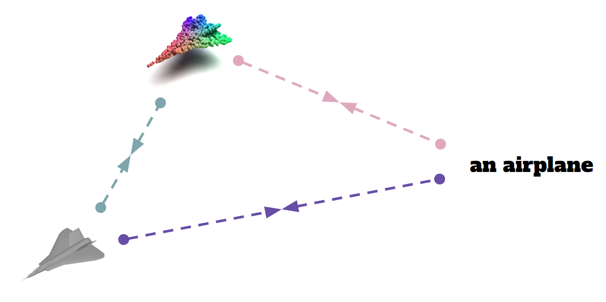
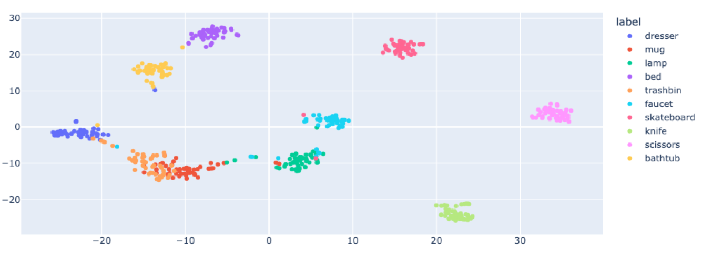
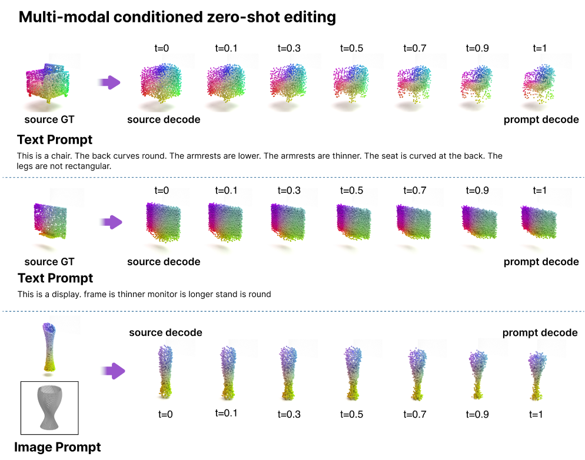

# ShapeBind
This project is from CS479 class in KAIST. 
Our goal is binding the three modality, 2d. text. 3d. 



  We introduce ShapeBind, a unified embedding space that embrace shape, vision and text modality. Using a similar approach with ImageBind, we show that shapes can be jointly embedded into CLIP latent space including rich and specific semantic information. Leveraging the prior text - vision knowledge from CLIP, we show that simply binding shape with text containing high semantic description of the shape is sufficient.


## Environment
```
conda env create -f shapebind_environment.yml
conda activate shapebind
```
if you have chamfer distance install error, you can install manually 
```
git submodule add https://github.com/ThibaultGROUEIX/ChamferDistancePytorch changeit3d/losses/ChamferDistancePytorch
```


## Files 
```
./Imagebind_LoRA
├──models ... # model construction
├──evaluations # evaluation codes
├──datasets 
├──changeit3d_model # for editing model but not used.
------------ # running files # -------------------------
├──deepspeed_train_3d_text.py
├──deepspeed_train_3d_decoder.py
├──mgpu_train_3d_text.py
├──zeroshot_classification.py
├──zeroshot_classification_shapetalk.py
├──interpolation.ipynb # you can edit the 3d shape using this file
```

## Usage
* Download data

    downlaod shapetalk data: [Github](https://github.com/optas/changeit3d#shapetalk-dataset--rocket-)


* training 3d-text binding model
```
cd Imagebind_LoRA

python -u deepspeed_train_3d_text.py --batch_size 12 --max_epochs 64 --num_workers 4 --device cuda:0:1 --full_model_checkpoint_dir {directory} --full_model_checkpointing --datasets_dir {directory} --loggers tensorboard --loggers_dir {directory} --datasets shapetalk --temperature 0.07
```

* training decoder model
```
cd Imagebind_LoRA

python -u deepspeed_train_3d_decoder.py --batch_size 192 --max_epochs 350 --num_workers 1 --device cuda:0:1 --encoder_latent_dim 1024 --full_model_checkpoint_dir {directory} --full_model_checkpointing --datasets_dir {directory} --loggers tensorboard --loggers_dir {directory} --datasets embedding
```

* testing zeroshot classifier
```
cd Imagebind_LoRA
python zeroshot_classification_shapetalk.py
```

* Editing using Slerp
```
Imagebind_LoRA/interpolation.ipynb
```

## Result
#### Embedding space(T-sne)

#### Editing



## Citing Shapebind
code based on Imagebind_LoRA [Github](https://github.com/fabawi/ImageBind-LoRA)

models/utils.py based on [Github](https://github.com/openai/point-e/blob/main/point_e/models/util.py)

utils/ based on Imagebind code


## References

[1] Girdhar, Rohit, et al. "Imagebind: One embedding space to bind them all." Proceedings of the IEEE/CVF Conference on Computer Vision and Pattern Recognition. 2023.

[2] Achlioptas, Panos, et al. "ShapeTalk: A Language Dataset and Framework for 3D Shape Edits and Deformations." Proceedings of the IEEE/CVF Conference on Computer Vision and Pattern Recognition. 2023.

[3] Yu, Xumin, et al. "Point-bert: Pre-training 3d point cloud transformers with masked point modeling." Proceedings of the IEEE/CVF Conference on Computer Vision and Pattern Recognition. 2022.

Acknowledgements
All three of us distributed the work evenly.

